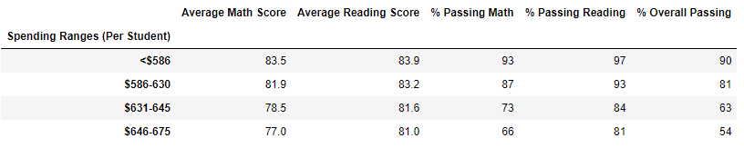

# School_District_Analysis
## Project Overview
The purpose of this project is to analyze school district data using Python and its Pandas and Numpy libraries. The school district data contains information for 15 different high schools and 39,169 total students. However, in this analysis, I first need to remove all the math and reading scores for 9th graders at a certain highschool, while keeping the rest of the data intact.

## Project Results
Setting the Thomas High School 9th grade math and reading test scores to Nan, affected the overall analysis as such:
  - The district school summary generally saw very minor drops in grade scores and percentages in the new analysis. This is probably due to Thomas High School being a high performing school and by removing its 9th grade class, it slightly lowered the district scores as a whole, but not a lot since the student count was low compared to all the students in the district.
    ### Original School District Analysis
    
    ### Updated School District Analysis
    
  
  - The school summary data analysis remained the same for all the schools except for Thomas High School since that was the one I removed the 9th grade scores. For Thomas High school, the scores and percentages remained very close to the original, indicating that 9th grade students at this school probably receive the same grade scores as their older peers.
    ### Original Per School Summary
    
    ### Updated Per School Summary
    
  
  - Replacing the Thomas High School 9th grade scores had a minimal change to the schools performance and therefore it did not really affect the school's performance relative to other schools.
  - When analyzing the differences in scores by grade, the removal of the Thomas High School 9th grade data had a major impact since the Thomas High School scores were now NaN and could not be compared to other schools. The other grade levels were unaffected.
    ### Original Math Score by Grade &nbsp; &nbsp; &nbsp; &nbsp; &nbsp; &nbsp; &nbsp; &nbsp; &nbsp; &nbsp; &nbsp; &nbsp; Updated Math Score by Grade
     &nbsp; &nbsp; &nbsp; &nbsp; &nbsp; &nbsp; &nbsp; &nbsp; &nbsp; &nbsp; &nbsp; &nbsp;  
    ### Original Reading Score by Grade &nbsp; &nbsp; &nbsp; &nbsp; &nbsp; &nbsp; &nbsp; &nbsp; &nbsp; &nbsp; Updated Reading Score by Grade
     &nbsp; &nbsp; &nbsp; &nbsp; &nbsp; &nbsp; &nbsp; &nbsp; &nbsp; &nbsp; &nbsp; &nbsp;     
  - When analyzing the differences in scores by school spending, Thomas High School fell in the $631-645 bin and by removing its 9th grade class scores, it had very minimal to no impact in that school spending range on its average scores or percentages.
    ### Original Per School Spending
    
    ### Updated Per School Spending
        
  
  - When analyzing the differences in scores by school size, Thomas High School fell in the medium category of 1000-1999 students, and by removing its 9th grade class scores, it had very minimal to no impact in that school size range on its average scores or percentages.
    ### Original Per School Size
    
    ### Updated Per School Size
    
  
  - When analyzing the differences in scores by school type, Thomas High School fell in the charter type, and by removing its 9th grade class scores, it had very minimal to no impact in that school type on its averge scores or percentges.
    ### Original Per School Type
    
    ### Updated Per School Type
    

## Project Summary
After the Thomas High School 9th grade student math and reading scores were replaced with NaN, the following four changes occured to the school district analysis:
  - A new district total student count had to be determined since their were 461 Thomas High school 9th graders no longer included in the analysis.
  - Calculate the new school district summary average test scores and percentage of students passing.
  - For the per school summary analysis portion, determine the count of Thomas High School 10-12th graders and calculated their respective scores and percentages.
  - Replaced the updated Thomas High School scores and percentages into the district summary dataframe.
